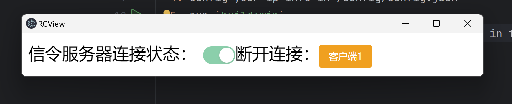

# rcview

A remote desktop Application based on Electron, Vue3, WebRTC, gRPC, and PyAutoGUI, developed for local area networks, supporting multiple clients.

## base use
  If your scenario involves two Win11 machines (which I have tested), you can
  1. directly modify the configuration information in config/config.json
  2. and then run it directly.

## build your own
  1. Install dependencies located in the root directory.
  2. Install 2 projects dependencies located in the thirdPartyProj/
  3. build thirdPartyProj/ 2 projects into exe use Pyinstaller and pkg cmd and Make sure the location of the .exe file is the same as in the demo.
  4. config your ip info in /config/config.json
  5. run `build:win`
  6. Set "IS_SERVER" to true and false respectively in the config.json on two computers.

# example:
the server likes:

the client likes:

